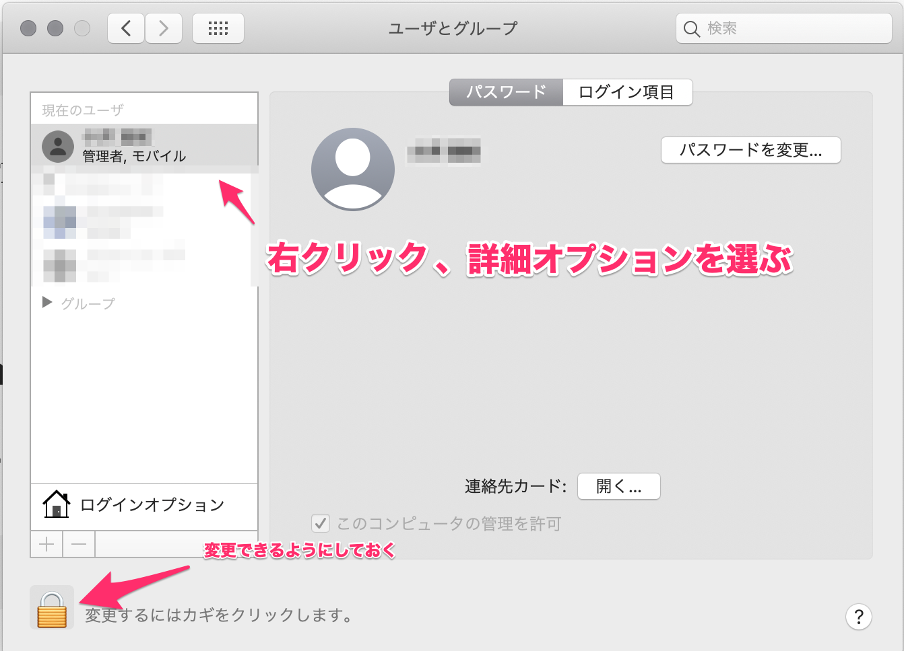
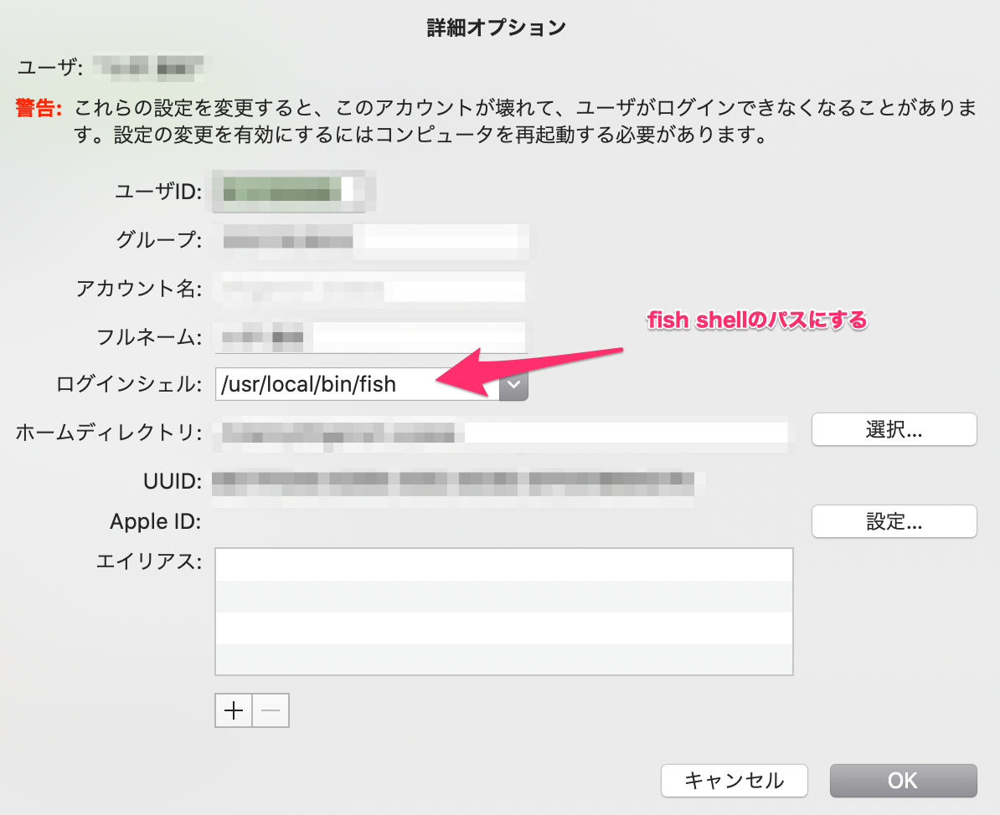

fish shell + nodenv環境の設定メモ。今回はanyenvを使う

## 環境

- macOS Catalina 10.15.7
- XCode 11.7
- fish shell 3.2.0

fishを使っている人はbrewを入れていると思うので、brewとfishのインストール方法は省略

## 手順

### 1. anyenv インストール

```shell
brew install anyenv
```

### 2. anyanv 初期化

```shell
anyenv init
```

### 3. config 修正

configの場所が異なる場合は、 `~/.config/fish/config.fish` の部分を読み替える

```shell
echo 'status --is-interactive; and source (anyenv init -|psub)' >> ~/.config/fish/config.fish
```

### 4. fish リロード

もしデフォルトシェルがfishでない場合は、ログインシェルを修正する

```shell
exec $SHELL -l
```

### 5. install manifestsの初期化

```shell
anyenv install --init
```

### 6. nodenv インストール

```shell
anyenv install nodenv
```

### 7. fish 再読み込み

```shell
exec $SHELL -l
```

### 8. node versionの指定

globalに指定したい場合は、 `local` を `global` に読み替える

```shell
nodenv local 14.14.0
```

### 9. node インストール

インストール可能なnode versionは、 `nodenv install -l` で参照

```shell
nodenv install 14.14.0
```

## ログインシェルの変更

意外とハマったので。fishはインストールしているけど、ログインシェルに当たっていない場合

### 1. fish shell追加

fish shellのインストール場所が `/usr/local/bin/fish` でない場合は、そのパスで読み替える

```shell
echo '/usr/local/bin/fish' >> /etc/shells
```

### 2. システム環境設定

システム環境設定を開き、ユーザとグループを選択



### 3. ユーザの設定変更

カギを解除しておき、変更対象のユーザーを選び、詳細オプションを表示する(右クリック)

ログインシェルをfish shellのパスに変更



## さいごに

anyenv入れておけば、多言語のxxxenv系を扱えるので便利。anyenv自体の更新をする場合は、以下のコマンドを実行すれば良い。

```shell
mkdir -p (anyenv root)/plugins

git clone https://github.com/znz/anyenv-update.git (anyenv root)/plugins/anyenv-update
```

※[参考 - anyenv update](https://github.com/znz/anyenv-update)