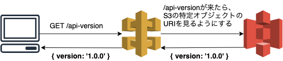

現職ではじめてWebAPI(REST Api)の開発、運用を行い、運用開始から2年ほど経ったのでいろいろと振り返ります。現職では、プロダクトのリニューアルがあったため、そのときにWebAPIを導入しました。また、途中からネイティブアプリ用の接続が増えたりした。

## 構成

- 仕様
  - [OpenAPI 3.0.0](https://swagger.io/specification/)
  - REST Apiに関するhow toは[Zalando RESTful API と イベントスキーマのガイドライン](https://restful-api-guidelines-ja.netlify.app/)を利用
- インフラ
  - Amazon API Gateway -> NLB -> ECS
developerguide/getting-started-with-private-integration.html)感じ
  - あとはAPI Gateway向けにOpenAPI拡張として [x-amazon-apigateway-integration](https://docs.aws.amazon.com/ja_jp/apigateway/latest/developerguide/api-gateway-swagger-extensions-integration.html) を使ったりしています
- 運用周り
  - [OpenAPI Generator](https://github.com/OpenAPITools/openapi-generator)を使用し、フロントエンドとバックエンドのコードを自動生成
    - フロントエンド: typescript-axios
      - APIコール用のfetcherが自動生成される
    - バックエンド: java-spring
      - Controllerとなるinterfaceが自動生成される
  - OpenAPI Generatorはプロダクト用に若干カスタマイズしている部分もある
    - APIの認可を指定する独自スコープ指定
    - 複数ファイルを一つマージするためのツール
    - APIコールに失敗しても例外を握り潰すための独自拡張

ざっくりとしたインフラ構成はこんなイメージ

*[API Gateway Lambda オーソライザーを使用する](https://docs.aws.amazon.com/ja_jp/apigateway/latest/developerguide/apigateway-use-lambda-authorizer.html)*より抜粋

## 良かった点

OpenAPIのドキュメントがしっかりしている
- 迷ったときはドキュメントを参照すれば良い

フロントエンドとバックエンドの型が自動生成されるので、型合わせミスによるエラーがない
- この仕組みを導入する前は型合わせミスによるエラーが多発していた

一度仕組みを作ってしまえば、あとはAPIを作ることだけに集中出来る
- 認可の仕組みやAPI Gateway拡張の定義もあまり理解せずとも利用することが出来る

ネイティブアプリも新規API以外は、今公開されているAPIを利用するだけで実装出来た
- バックエンド側の開発コストが抑えられ、クライアントに依存せずスケールすることが出来た

## 悪かった点、辛かった点

複数チームで開発したことで、API定義にばらつきが出来た
- APIのパスが統一出来ていない
  - Lower-camel-case、Kabab-case
  - 単数形、複数形
- リソースの切り方が統一出来ていない
  - 1エンドポイントが返却するレスポンスが多すぎる
  - レスポンスに識別子が含まれないのでサブリソースにアクセス出来ない

型通りのレスポンスが返却されない
- 型通りのレスポンスが来ないパターンがある(型的にはNonNullだが、バックエンドがNullを返却してしまう)
  - フロント側ではエラーが発生する。Sentryでアラートがなるでそこで検知

強制バージョンアップの仕組みがない
- APIの破壊的な変更や、ユーザー側に新しいAPIを利用してもらいたいときにそれが出来ない
  - ユーザーがリロードする、キャッシュが破棄されるなどユーザーに左右される

API定義の検証がローカルで出来ない
- API Gatewayを含む環境がローカルでは再現できないため、API定義として正しいかは検証環境確認時となる
  - エラーが発生した時の修正にコストがかかる
  - 仕組みができあがっているため、細部まで知らないメンバーが多かった

アプリとWebで画面が違ったため、アプリから見ると不都合なエンドポイントがある
- チーム間でばらつき画面に特化したエンドポイントになりがちだった
- 同じ画面でも(例えばマイページ)必要な情報を得るためにWebよりもコール回数が多い、無駄な情報が多いという状況

## 改善すべき点

> 複数チームで開発したことで、API定義にばらつきが出来た

ツールの利用もしくは、記述方式はLinterを利用する
- [Swagger Editor](https://swagger.io/tools/swagger-editor/)
  - 自分たちのプロジェクトではyamlを分割していたのですこし相性が悪かった
- [Stoplight](https://stoplight.io/)
  - 個人でも使えるが、プロジェクト利用を考えると有償になりそう

> 型通りのレスポンスが返却されない

あまり良い方法が思いつかないが、コントローラー側でのNonNullに対するテストを書く

> 強制バージョンアップの仕組みがない

これは時間がなかったという理由で導入されなかった(一応、回避策としてフロントエンド側で一定の条件を満たすとリロードをかける仕組みを作っている)。

ユーザーの使用するapiを更新する仕組みは、導入当初でも優先的に開発した方がよい。また、導入が遅れても優先的に開発する。

どんな方法でも良いが、例えばAPI GatewayのバックエンドをS3にして、そこにAPIバージョンを記載したJSONファイルを配置、フロントエンド側では今のAPIバージョンとS3にあるバージョンを比較し、メジャーバージョンが違えば更新するというようにすると良いと思います(この機能自体は後から追加しました)。

> アプリとWebで画面が違ったため、アプリから見ると不都合なエンドポイントがある

エンドポイントの設計を統一するというのが原則であるが、どうしてもREST Apiではこの問題は発生してしまう。こういう場合は、BFFのようなフロントエンドよりのAggregateAPIみたいなものを用意した方がフロントエンドはつい勝手が良いと思います。

## まとめ

初めてのWebAPI開発が複数チームでの開発となるとやはりばらつきが出来てしまうのは仕方ないなーと思う部分が大きいです。ただ、変更しづらいものをユーザー影響が少なくなるように変更する手立てがなかったのが今回失敗だったと思っています。

フロントエンドやバックエンドほどリファクタリングしやすいものでもなく、リグレッションテストが大変なものなので手はつけづらいところですが、放置すると取り返しのつかない状態になり、徐々に更新していくことが出来なくなります。

今回は初めてWebAPIを運用していろいろ反省点はありましたが、運用自体は割と安定しているのでここであげたような改善が出来ればと思います。
